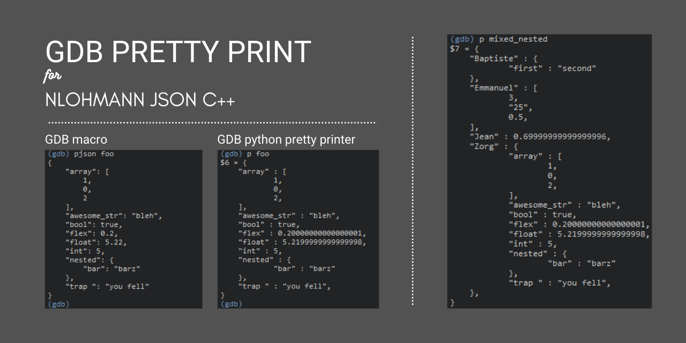

# A simplistic GDB pretty printer for [nlohmann-json c++][3] 

Provides GDB script and python GDB script to pretty print a  [nlohmann / json][3]
 - [x] compatible with a live inferior process and debug symbols
 - [x] compatible with core dump files with debug symbols
 - Tested on:
   - Win Intel x64
   - Raspbian arm x32

---

**Table of contents**
 
 1. [Prerequisites](#Prerequisites)
 2. [Installing](#Installing)
 3. [Content](#Content)
 4. [Usage](#4Usage)
 5. [Possible improvements / Contributions](#Possible-improvements-Contributions)
 6. [Known limitations](#Known-limitations)
 7. [Examples / Tests](#Examples-Tests)  
 8. [History](#History)
 9. [Acknowledgments / LICENSES](#Acknowledgments-LICENSES)
 10. [Links concerning STL and GDB](#Links)

<a name="Prerequisites"></a>
# 1. Prerequisites

 - *GDB 8.3* debugger installed, ready to use. Python support started with GDB 7, so it may work with versions starting GDB 7 _Some [GDB commands knowledge][4] might be useful for your debug session to be successful ;)_
 - an executable to debug **with debug symbols available to GDB** which uses the [JSON lib 3.7.3][3]
 - or a core dump **with debug symbols available to GDB** (for linux users)
 

## Optional

 - a [GNAT CE 2019][2] install to compile and play with the provided test projects


## Compatibility
 
 For the GDB command, it should work with other GDB versions that support commands and printf (GDB 7+).

 For the GDB Python pretty printer, it should work with any GDB version that supports python (provided no GDB api change, otherwise python code will be broken); i.e. GDB 7+. Be aware that the python code relies on some [JSON lib types definition][3], so JSON lib and python pretty printer code should be matching.

<a name="Installing"></a>
# 2. Installing

Just copy the GDB and/or python script you need in a folder near your executable to debug, and of course, load it into your GDB.
See [Content](#Content) and [Usage](#Usage) sections below for more details.

Your GDB does not support python ?
Have a look [here for an example of GDB build on raspbian 9.11](https://github.com/LoneWanderer-GH/nlohmann-json-gdb/wiki/C---build-environment-:-GDB-8.3-on-Raspberry-Pi-3--Raspbian-9.11-stretch)

<a name="Content"></a>
# 3. Content

 - [x] the *[GDB command](gdb_script/simple_gdb_method.gdb)* : it uses the live process under debug to call `dump()`. It implies that the executable and memory are not corrupted, variables not optimized out
 - [x] the *[python GDB pretty printer](gdb_python_pretty_printer)* : here, we do not rely on the existing dump() method but we explore memory to do it ourselves, if the inferior process is broken in some way, we may still have some means to dump a json compare to previous method.
 
  - [x] a [sample c++ project](cpp_test_project), see [7. Examples / Tests](#7-Examples--Tests) for further details
  
  - [x] a [cpp project to bruteforcefully find relevant offets for a given platform](offsets_finder)

<a name="Usage"></a>
 # 4. Usage
 
 ## How to load a GDB script

 in your GDB console:
 ```
 (gdb) source some_file
 ```
 Works for both GDB and Python scripts.
 I strongly suggest you refer to GDB documentation.

 ## GDB pretty printer usage (the Python printer)

 The GDB Pretty printer is [written in Python](gdb_python_pretty_printer/printer.py) which is loaded with a [GDB script](gdb_python_pretty_printer/load_pretty_printer.gdb)

 Then, a simple GDB command does the trick:

 ```
(gdb) p foo
{
    "flex" : 0.2,
    "awesome_str": "bleh",
    "nested": {
        "bar": "barz"
    }
}
```

 ## GDB script usage (the GDB command)

Here we use a kind of **GDB macro** defined in a [GDB script file](gdb_script/simple_gdb_method.gdb)

 ```
(gdb) pjson foo
{
    "flex" : 0.2,
    "awesome_str": "bleh",
    "nested": {
        "bar": "barz"
    }
}
```

## No debug symbols ?

That's a more advanced GDB technique. You should have a look at [this SO post](https://stackoverflow.com/questions/866721/how-to-generate-gcc-debug-symbol-outside-the-build-target) where pretty much everything is explained.

_The idea is to compile and extract the debug data into specific files.
Then load this files into your GDB to have all symbols at hand, even if you're working with a stripped software._

see also [this GDB doc](https://doc.ecoscentric.com/gnutools/doc/gdb/Files.html#Files) concerning `symbol-file `command.

<a name="Possible-improvements-Contributions"></a>
# 5. Possible improvements / Contributions

## Contribute

_Coding technique for the pretty printer is quite naive, but it works.
Any seasoned advice and support appreciated. Aspects I would like to improve:_
 - performance
 - walking in memory using as much GDB commands instead of hardcoding some offsets. This requires both knowledge of GDB and the JSON library symbols usage

## Possible TODO list

 - [x] ~~the pythonGDBpretty printer core dump management is not (yet ?) done (i.e. core dump means no inferior process to call dump() in any way, and possibly less/no (debug) symbols to rely on)~~ Core dump with debug symbols tested and should be working.
 - [ ] printer can be customised further to print the 0x addresses, I chose not to since the whole point for me was NOT to explore them in GDB. You would have to add few python `print` here and there
 - [ ] add the hexa value for floating point numbers, or for all numerical values
 - [ ] GDB offers a [command to perform the same task in a probably more convenient way](https://stackoverflow.com/questions/1768620/how-do-i-show-what-fields-a-struct-has-in-gdb)(see [docs](https://sourceware.org/gdb/current/onlinedocs/gdb/Symbols.html#Symbols), I discovered that a bit late :D)
        ```
        ptype
        ptype /o struct my_struct
        ```
 
 
<a name="Known-limitations"></a>
# 6. Known limitations

 - Floating point numbers may appear differently depending on the method used. This is due to differences in float-to-string from [GDB][4] and [json c++][3].
For more confidence, we could modify the python pretty printer to provide the exact hexadecimal memory value + the decimal one for sake of completness.

 - Linux over windows exe build : `gprbuild` command on Ubuntu-windows/Debian-windows may not work correctly, so a legit Linux environment may be needed if you want to play with this on Linux.

 - other platforms : feel free to find other platform offsets, or provide a better programmatic method to navigate into the memory.
 
<a name="Examples-tests"></a>
 # 7. Examples / Tests

## The test project

The C++ project [debug_printer.gpr](cpp_test_project/debug_printer.gpr) can be built with the following command
`gprbuild -p -P debug_printer.gpr`
(`-p`creates the obj/exe dirs if missing)

 see [main.cpp](cpp_test_project/src/main.cpp) for some basic C++ JSON declarations.

 example:
 ```// C++ code
...
json foo;
foo["flex"] = 0.2;
foo["bool"] = true;
foo["int"] = 5;
foo["float"] = 5.22;
foo["trap "] = "you fell";
foo["awesome_str"] = "bleh";
foo["nested"] = {{"bar", "barz"}};
foo["array"] = { 1, 0, 2 };
...
```

 GDB commands (once everything correctly loaded)

 ```(gdb) pjson foo
{
    "array": [
        1,
        0,
        2
    ],
    "awesome_str": "bleh",
    "bool": true,
    "flex": 0.2,
    "float": 5.22,
    "int": 5,
    "nested": {
        "bar": "barz"
    },
    "trap ": "you fell"
}
 ```

 GDB python pretty printer:

 ```
 (gdb) p foo
 {
    "array" : [
            1,
            0,
            2,
    ],
    "awesome_str" : "bleh",
    "bool" : true,
    "flex" : 0.20000000000000001,
    "float" : 5.2199999999999998,
    "int" : 5,
    "nested" : {
            "bar" : "barz"
    },
    "trap " : "you fell",
}
```

## Awful bruteforce method to find the relevant offsets

 1. build the project [simple_offsets_finder.gpr](offsets_finder/simple_offsets_finder.gpr) with the command
        `gprbuild -p -P debug_printer.gpr`
        ```

 2. Start a GDB session, here is an example on Raspberry Pi 3+ (arm32):

```
(gdb) file offsets_finder/exe/main  ## you may change the path to fit your folder tree
Reading symbols from offsets_finder/exe/main...
No breakpoints or watchpoints.
(gdb) source offsets_finder/.gdbinit
#
# Force gdb to use pretty print of structures managed by default (instead of a barely flat line)
PLATFORM_BITS 32
#
# Auto setting break point before exe prints mixed_nested
Breakpoint 1 at 0x11c8c: file offsets_finder/src/main.cpp, line 44.
#
# Running the exe

Breakpoint 1, main () at offsets_finder/src/main.cpp:44
#
# ### Prints using python pretty printer offsetts finder ###
#
# Print foo (python pretty printer)
$1 = Found the key '"first"'
Found the value '"second"'


Offsets for STD::MAP exploration are:

MAGIC_OFFSET_STD_MAP            = 8
MAGIC_OFFSET_STD_MAP_NODE_COUNT = 12
MAGIC_OFFSET_STD_MAP_KEY        = 16
MAGIC_OFFSET_STD_MAP_VAL        = 24

 ===> Offsets for STD::MAP : [ FOUND ] <=== 

#
$2 = 

Offsets for STD::VECTOR exploration are:

MAGIC_OFFSET_STD_VECTOR = 76

 ===> Offsets for STD::VECTOR : [ FOUND ] <=== 
```

 ## Another approach I know of
 _from a guru of my workplace_
  - simply define a single function in the program to perform the dump of a json variable, say `print()`. Then you can call it during yourGDBsession.
  This is almost exactly similar to theGDBinferior dump() call macro `pjson` presented above.
  
<a name="History"></a>
# 8. History

 - In March 2019, I was stuck with the lack of nlohmann json debug utilities. I could not find any support to print what the json was during a debug session. I ended up with a stack overflow post with [what I found to be revelant][1] for that matter. In addition, I was interested in playing around with GDB/memory/python, thats why I took some time to treat this matter. I ended up with the code here.
 - In 2020 a Github issue was opened with the same intent here and relies basically on the same initial solution I used: https://github.com/nlohmann/json/issues/1952

_I'm not claiming any right or precedence over the official nlohmann / json issue or the method to perform the print using dump(). I think we all did the same thing by serendipity, and I bet I am not the first one  to have taken the .dump() call approach. All in all, if everyone can ~~work~~ debug better, that all that matters to me_

<a name="Acknowledgments-LICENSES"></a>
# 9. Acknowledgments / LICENSES

## ACKNOWLEDGMENTS

 - The [GDB documentation][4] was particularly useful, in particular the [Python part][5].
 - The red black tree traversal and STL exploration in python is directly inspired from the STLGDBscripts.

A few other links were useful and are linked in the python source.
 - The python exceptions printing is [inspired from GEF][6]
 - The `std::string` print in pythonGDBis inspired from [this stackoverflow post][7]

## LICENSE
My work is under following license
> Licensed under the MIT License <http://opensource.org/licenses/MIT>.
> SPDX-License-Identifier: MIT
>
> Copyright (c) 2020 LoneWanderer-GH https://github.com/LoneWanderer-GH
>
>Permission is hereby  granted, free of charge, to any  person obtaining a copy of this software and associated  documentation files (the "Software"), to deal in the Software  without restriction, including without  limitation the rights to  use, copy,  modify, merge,  publish, distribute,  sublicense, and/or  sell copies  of  the Software,  and  to  permit persons  to  whom  the Software  is furnished to do so, subject to the following conditions:
> 
> The above copyright notice and this permission notice shall be included in all copies or substantial portions of the Software.
>
> THE SOFTWARE  IS PROVIDED "AS  IS", WITHOUT WARRANTY  OF ANY KIND,  EXPRESS OR IMPLIED,  INCLUDING BUT  NOT  LIMITED TO  THE  WARRANTIES OF  MERCHANTABILITY, FITNESS FOR  A PARTICULAR PURPOSE AND  NONINFRINGEMENT. IN NO EVENT  SHALL THE AUTHORS  OR COPYRIGHT  HOLDERS  BE  LIABLE FOR  ANY  CLAIM,  DAMAGES OR  OTHER LIABILITY, WHETHER IN AN ACTION OF  CONTRACT, TORT OR OTHERWISE, ARISING FROM, OUT OF OR IN CONNECTION WITH THE SOFTWARE  OR THE USE OR OTHER DEALINGS IN THE SOFTWARE.

## Some files in this repo are not mine and under other licenses
### nlohmann JSON for Modern C++

as per the file content:

> JSON for Modern C++
> version 3.7.3
> https://github.com/nlohmann/json
>
> Licensed under the MIT License <http://opensource.org/licenses/MIT>
> SPDX-License-Identifier: MIT
> Copyright (c) 2013-2019 Niels Lohmann <http://nlohmann.me>

### STL GDB evaluators/views/utilities - 1.03

as per the file content:

>   Simple GDB Macros writen by Dan Marinescu (H-PhD) - License GPL
>   Inspired by intial work of Tom Malnar,
>     Tony Novac (PhD) / Cornell / Stanford,
>     Gilad Mishne (PhD) and Many Many Others.
>   Contact: dan_c_marinescu@yahoo.com (Subject: STL)
>
>   Modified to work with g++ 4.3 by Anders Elton
>   Also added _member functions, that instead of printing the entire class in map, prints a member.

<a name="Links"></a>
# 10. Links

Some useful links concerning STL and GDB

- https://sourceware.org/gdb/wiki/STLSupport
- http://www.yolinux.com/TUTORIALS/src/dbinit_stl_views-1.03.txt
- http://wiki.codeblocks.org/index.php/Pretty_Printers
- https://github.com/NREL/EnergyPlus/wiki/Debugging-STL-objects-in-GDB
- https://stackoverflow.com/questions/11606048/how-to-pretty-print-stl-containers-in-gdb
- https://gist.github.com/chaozh/9252fc01b3723f795589
- https://gist.github.com/skyscribe/3978082

[1]: https://stackoverflow.com/q/55316620/7237062
[2]: https://www.adacore.com/community
[3]: https://github.com/nlohmann/json
[4]: https://sourceware.org/gdb/current/onlinedocs/gdb/index.html
[5]: https://sourceware.org/gdb/current/onlinedocs/gdb/Python-API.html#Python-API
[6]: https://github.com/hugsy/gef/blob/dev/gef.py
[7]: https://stackoverflow.com/questions/6776961/how-to-inspect-stdstring-in-gdb-with-no-source-code
